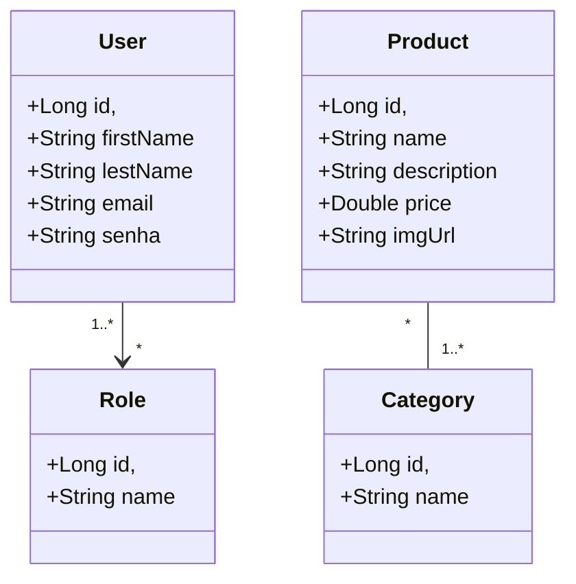

## Modelo conceitual do Catalog



## Category
```
@Entity
@Table(name = "tb_categoryo")
public class Category implements Serializable {

    @Serial
    private static final long serialVersionUID = 3656677328282961586L;

    @Id
    @GeneratedValue(strategy = GenerationType.UUID)
    private UUID id;
    private String name;
    private Instant createdAt;
    private Instant updatedAt;
    private boolean active;

    public Category() {
    }

    public Category(UUID id, String name, Instant createdAt, Instant updatedAt, boolean active) {
        this.id = id;
        this.name = name;
        this.createdAt = createdAt;
        this.updatedAt = updatedAt;
        this.active = active;
    }

    public UUID getId() {
        return id;
    }

    public void setId(UUID id) {
        this.id = id;
    }

    public String getName() {
        return name;
    }

    public void setName(String name) {
        this.name = name;
    }

    public Instant getCreatedAt() {
        return createdAt;
    }

    public Instant getUpdatedAt() {
        return updatedAt;
    }

    public boolean isActive() {
        return active;
    }

    public void setActive(boolean active) {
        this.active = active;
    }

    @PrePersist
    public void prePersist() {
        createdAt = Instant.now();
        this.updatedAt = createdAt;
        active = true;
    }

    @PreUpdate
    public void preUpdate() {
        updatedAt = Instant.now();
    }

    @Override
    public boolean equals(Object object) {
        if (this == object) return true;
        if (object == null || getClass() != object.getClass()) return false;
        Category category = (Category) object;
        return Objects.equals(id, category.id);
    }

    @Override
    public int hashCode() {
        return Objects.hash(id);
    }
}
```

## CategoryResponse
```
public record CategoryResponse(
        UUID id,
        String name,
        Instant createdAt,
        Instant updateAt,
        boolean active
) implements Serializable {
    @Serial
    private static final long serialVersionUID = -4974682369660931936L;
}
```

## CategoryRequest
```
public record CategoryRequest(
        String name
) implements Serializable {
    @Serial
    private static final long serialVersionUID = -4974682369660931936L;
}
```

## CategoryMapper
```
public final class CategoryMapper {
    public static CategoryResponse toDTO(Category entity) {
        return new CategoryResponse(
                entity.getId(),
                entity.getName(),
                entity.getCreatedAt(),
                entity.getUpdatedAt(),
                entity.isActive()
        );
    }

    public static Category toEntity(CategoryResponse response) {
        return new Category(
                response.id(),
                response.name(),
                response.createdAt(),
                response.updateAt(),
                response.active()
        );
    }

    public static Category toEntity(CategoryRequest request) {
        Category entity = new Category();
        entity.setName(request.name());

        return entity;
    }

}
```

## CategoryRepository
```
@Repository
public interface CategoryRepository extends JpaRepository<Category, UUID> {

    //    @Query(nativeQuery = true, value = "SELECT * FROM tb_category c WHERE c.id = :id AND c.active = :active")
    boolean existsByIdAndActive(Long id, Boolean active);

    Optional<Category> findByIdAndActive(UUID id, Boolean active);

    Optional<Category> findByNameAndActive(String name, Boolean active);
}
```

## CategoryService
```
@Service
public class CategoryCreateService {
    private final CategoryRepository categoryRepository;

    public CategoryCreateService(CategoryRepository categoryRepository) {
        this.categoryRepository = categoryRepository;
    }

    public CategoryResponse execute(CategoryResponse dto) {
        Category entity = CategoryMapper.toEntity(dto);
        entity = categoryRepository.save(entity);
        return CategoryMapper.toDTO(entity);
    }
}

@Service
public class CategoryFindAllService {
    private final CategoryRepository categoryRepository;

    public CategoryFindAllService(CategoryRepository categoryRepository) {
        this.categoryRepository = categoryRepository;
    }

    @Transactional(readOnly = true)
    public Page<CategoryResponse> execute(Pageable pageable) {
        Page<Category> categories = categoryRepository.findAll(pageable);
        return categories.map((category) -> new CategoryResponse(category.getId(), category.getName(), category.getCreatedAt(), category.getUpdateAt(), category.isActive()));
    }
}

@Service
public class CategoryFindByIdService {
    private final CategoryRepository categoryRepository;

    public CategoryFindByIdService(CategoryRepository categoryRepository) {
        this.categoryRepository = categoryRepository;
    }

    @Transactional(readOnly = true)
    public CategoryResponse execute(UUID id) {
        Objects.requireNonNull(id);
        Category entity = categoryRepository.findByIdAndActive(id, true)
                .orElseThrow(() -> new EntityNotFoundException("Id not found"));
        return CategoryMapper.toDTO(entity);
    }
}

@Service
public class CategoryUpdateService {
    private final CategoryRepository categoryRepository;

    public CategoryUpdateService(CategoryRepository categoryRepository) {
        this.categoryRepository = categoryRepository;
    }

    @Transactional
    public CategoryResponse execute(UUID id, CategoryRequest request) {
        try {
            Objects.requireNonNull(id);
            Category entity = categoryRepository.getReferenceById(id);
            entity.setName(request.name());
            entity = categoryRepository.save(entity);
            return CategoryMapper.toDTO(entity);
        } catch (EntityNotFoundException e) {
            throw new AppEntityNotFoundException(AppExceptionConstants.ENTITY_NOT_FOUND + id);
        }
    }
}

@Service
public class CategoryActiveService {

    private final CategoryRepository categoryRepository;

    public CategoryActiveService(CategoryRepository categoryRepository) {
        this.categoryRepository = categoryRepository;
    }

    @Transactional
    public void execute(UUID id) {
        Objects.requireNonNull(id);
        Category entity = categoryRepository
                .findByIdAndActive(id, false)
                .orElseThrow(() -> new AppEntityNotFoundException(AppExceptionConstants.ENTITY_NOT_FOUND + id));
        entity.setActive(true);
        categoryRepository.save(entity);
    }
}

@Service
public class CategoryDeactivateService {
    private final CategoryRepository categoryRepository;

    public CategoryDeactivateService(CategoryRepository categoryRepository) {
        this.categoryRepository = categoryRepository;
    }

    @Transactional
    public void execute(UUID id) {
        Objects.requireNonNull(id);
        Category entiry = categoryRepository.findByIdAndActive(id, true)
                .orElseThrow(() -> new AppEntityNotFoundException(AppExceptionConstants.ENTITY_NOT_FOUND + id));
        entiry.setActive(false);
        categoryRepository.save(entiry);
    }
}

@Service
public class CategoryDeleteService {
    private final CategoryRepository categoryRepository;

    public CategoryDeleteService(CategoryRepository categoryRepository) {
        this.categoryRepository = categoryRepository;
    }

    public void execute(Long id) {
        try {
            if (categoryRepository.existsByIdAndActive(id, true) || !categoryRepository.existsByIdAndActive(id, false)) {
                throw new AppEntityNotFoundException(AppExceptionConstants.ENTITY_NOT_FOUND);
            }
            categoryRepository.deleteById(id);
        } catch (DataIntegrityViolationException e) {
            throw new AppDataIntegrityViolationException(AppExceptionConstants.DATA_INTEGRITY_VIOLATION);
        }
    }
}
```

## CategoryResource
```
@RestController
@RequestMapping(value = "/categories")
public class CategoryCreateResource {
    private final CategoryCreateService categoryCreateService;

    public CategoryCreateResource(CategoryCreateService categoryCreateService) {
        this.categoryCreateService = categoryCreateService;
    }

    @PostMapping
    public CompletableFuture<ResponseEntity<CategoryResponse>> handle(@RequestBody CategoryResponse request) {
        CategoryResponse response = categoryCreateService.execute(request);
        URI uri = ServletUriComponentsBuilder.fromCurrentRequest().path("/{id}").buildAndExpand(response.id()).toUri();
        return supplyAsync(() -> response).thenApply((__) -> ResponseEntity.created(uri).body(response));
    }
}

@RestController
@RequestMapping(value = "/categories")
public class CategoryFindAllResource {
    private final CategoryFindAllService categoryFindAllService;

    public CategoryFindAllResource(CategoryFindAllService categoryFindAllService) {
        this.categoryFindAllService = categoryFindAllService;
    }

    @GetMapping
    public CompletableFuture<ResponseEntity<Page<CategoryResponse>>> handle(Pageable pageable) {
        return CompletableFuture.supplyAsync(() -> categoryFindAllService.execute(pageable))
                .thenApply((category) -> ResponseEntity.ok().body(category));
    }
}

@RestController
@RequestMapping(value = "/categories")
public class CategoryFindByIdResource {
    private final CategoryFindByIdService categoryFindByIdService;
    private final Executor executor;

    public CategoryFindByIdResource(CategoryFindByIdService categoryFindByIdService, Executor executor) {
        this.categoryFindByIdService = categoryFindByIdService;
        this.executor = executor;
    }

    @GetMapping(value = "/{id}")
    public CompletableFuture<ResponseEntity<CategoryResponse>> handle(@PathVariable UUID id) {
        return supplyAsync(() -> categoryFindByIdService.execute(id), executor).thenApply((category) -> ResponseEntity.ok().body(category));
    }
}

@RestController
@RequestMapping(value = "/categories")
public class CategoryUpdateResource {
    private final CategoryUpdateService categoryUpdateService;
    private final Executor executor;

    public CategoryUpdateResource(CategoryUpdateService categoryUpdateService, Executor executor) {
        this.categoryUpdateService = categoryUpdateService;
        this.executor = executor;
    }

    @PutMapping(value = "/{id}")
    public CompletableFuture<ResponseEntity<CategoryResponse>> handle(@PathVariable UUID id, @RequestBody CategoryRequest request) {
        return supplyAsync(() -> categoryUpdateService.execute(id, request), executor).thenApply((category) -> ResponseEntity.ok().body(category));
    }
}

@RestController
@RequestMapping(value = "/categories")
public class CategoryActiveResource {
    private final CategoryActiveService categoryActiveService;
    private final Executor executor;

    public CategoryActiveResource(CategoryActiveService categoryActiveService, Executor executor) {
        this.categoryActiveService = categoryActiveService;
        this.executor = executor;
    }

    @PatchMapping(value = "/active/{id}")
    public CompletableFuture<ResponseEntity<Void>> handle(@PathVariable UUID id) {
        return CompletableFuture
                .runAsync(() -> categoryActiveService.execute(id), executor)
                .thenApply((r) -> ResponseEntity.noContent().build());
    }
}

@RestController
@RequestMapping(value = "/categories")
public class CategoryDeactivateResource {
    private final CategoryDeactivateService categoryDeactivateService;
    private final Executor executor;

    public CategoryDeactivateResource(CategoryDeactivateService categoryDeactivateService, Executor executor) {
        this.categoryDeactivateService = categoryDeactivateService;
        this.executor = executor;
    }

    @PatchMapping(value = "/deactivate/{id}")
    public CompletableFuture<ResponseEntity<Void>> handle(@PathVariable UUID id) {
        return CompletableFuture
                .runAsync(() -> categoryDeactivateService.execute(id), executor)
                .thenApply((result) -> ResponseEntity.noContent().build());
    }
}

@RestController
@RequestMapping(value = "/categories")
public class CategoryDeleteResource {
    private final CategoryDeleteService categoryDeleteService;

    public CategoryDeleteResource(CategoryDeleteService categoryDeleteService) {
        this.categoryDeleteService = categoryDeleteService;
    }

    @DeleteMapping(value = "/{id}")
    public ResponseEntity<Void> handle(@PathVariable UUID id) {
        categoryDeleteService.execute(id);
        return ResponseEntity.noContent().build();
    }
}
```
## Parâmetros de paginação
```
@RequestParam(value = "page", defaultValue = "0") Integer page,
@RequestParam(value = "linesPerPage", defaultValue = "12") Integer linesPerPage,
@RequestParam(value = "orderBy", defaultValue = "moment") String orderBy,
@RequestParam(value = "direction", defaultValue = "DESC") String direction)
```
