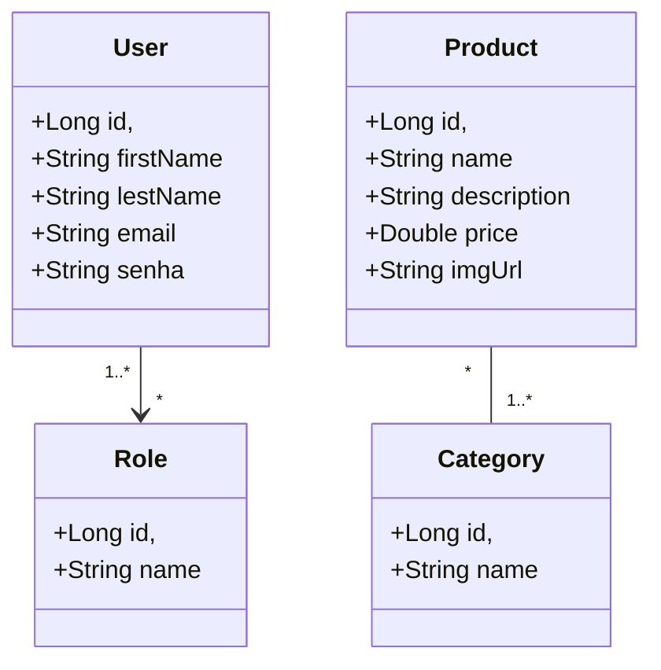

## Modelo conceitual do Catalog




## Salvando entidade associada para um 

```
VERSION 01
POST http://localhost:8080/people
{
    "name": "Nova Pessoa",
    "salary": 8000.0,
    "department": {
        "id": 1
    }
}

VERSION 02
POST http://localhost:8080/people
{
    "name": "Nova Pessoa",
    "salary": 8000.0,
    "departmentId": 1
}
```

## PersonCustomDTO

```
public record PersonCustomDTO(
        Long id,
        String name,
        Double salary,
        DepartmentDTO department
) implements Serializable {

    @Serial
    private static final long serialVersionUID = -286391865846298555L;
}

```

## PersonMapper

```
    public static PersonDepartmentCustomDTO toDTO(Person entity) {
        return new PersonDepartmentCustomDTO(
                entity.getId(),
                entity.getName(),
                entity.getSalary(),
                entity.getDepartment().getId()
        );
    }

    public static Person toEntity(PersonDepartmentCustomDTO dto, DepartmentRepository departmentRepository) {
        Person entity = new Person();
        entity.setId(dto.id());
        entity.setName(dto.name());
        entity.setSalary(dto.salary());
        entity.setDepartment(departmentRepository.getReferenceById(dto.departmentId()));
        return entity;
    }
}
```

## PersonService

```
@Service
public class PersonCreateService {
    private final PersonRepository personRepository;
    private final DepartmentRepository departmentRepository;

    public PersonCreateService(PersonRepository personRepository, DepartmentRepository departmentRepository) {
        this.personRepository = personRepository;
        this.departmentRepository = departmentRepository;
    }

//    public PersonCustomDTO execute(PersonCustomDTO dto) {
//        Person entity = new Person();
//        entity.setName(dto.name());
//        entity.setSalary(dto.salary());
//
//        Department dept = departmentRepository.getReferenceById(dto.department().id());
//        /* Department dept = new Department();
//        dept.setId(dto.department().id()); */
//        entity.setDepartment(dept);
//        entity = personRepository.save(entity);
//
//        return new PersonCustomDTO(
//                entity.getId(),
//                entity.getName(),
//                entity.getSalary(),
//                new DepartmentDTO(
//                        entity.getDepartment().getId(),
//                        entity.getDepartment().getName()
//                ));
//    }

    public PersonDepartmentCustomDTO execute(PersonDepartmentCustomDTO dto) {
        Person entity = PersonMapper.toEntity(dto, departmentRepository);
        /*Department department = departmentRepository.getReferenceById(dto.departmentId());
        entity.setDepartment(department);*/
        entity = personRepository.save(entity);
        return PersonMapper.toDTO(entity);
    }

    /*public PersonCustomDTO execute(PersonCustomDTO dto) {
        Person entity = PersonMapper.toEntity(dto);
        Department department = departmentRepository.getReferenceById(dto.department().id());
        entity.setDepartment(department);
        entity = personRepository.save(entity);
        return PersonMapper.toDTO(entity);
    }*/

    /*public PersonCustomDTO execute(PersonCustomDTO dto) {
        Person entity = PersonMapper.toEntity(dto, departmentRepository);
        entity = personRepository.save(entity);
        return PersonMapper.toDTO(entity);
    }*/
}

```

## PersonController

```
@RestController
@RequestMapping(value = "/people")
public class PersonCreateController {

    private final PersonCreateService personCreateService;

    public PersonCreateController(PersonCreateService personCreateService) {
        this.personCreateService = personCreateService;
    }


    /*@PostMapping
    public CompletableFuture<ResponseEntity<PersonCustomDTO>> handle(@RequestBody PersonCustomDTO request) {
        PersonCustomDTO response = personCreateService.execute(request);
        URI uri = ServletUriComponentsBuilder.fromCurrentRequest().path("/{id}").buildAndExpand(response.id()).toUri();
        return supplyAsync(() -> response).thenApply((__) -> ResponseEntity.created(uri).body(response));
    }*/

    @PostMapping
    public CompletableFuture<ResponseEntity<PersonDepartmentCustomDTO>> handle(@RequestBody PersonDepartmentCustomDTO request) {
        PersonDepartmentCustomDTO response = personCreateService.execute(request);
        URI uri = ServletUriComponentsBuilder.fromCurrentRequest().path("/{id}").buildAndExpand(response.id()).toUri();
        return supplyAsync(() -> response).thenApply((__) -> ResponseEntity.created(uri).body(response));
    }
}

```
